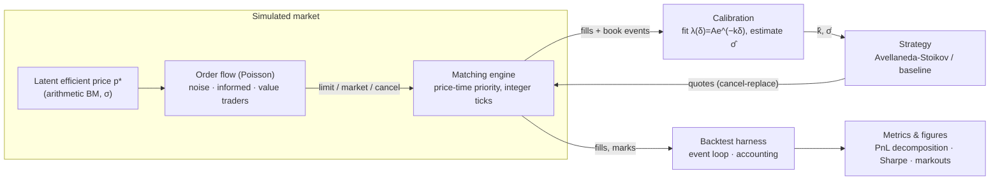
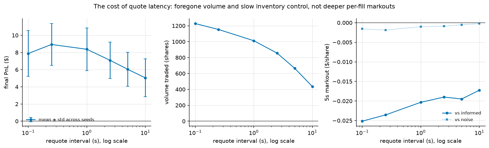

# market-maker-sim

[](https://github.com/axm0/market-maker-sim/actions/workflows/ci.yml)


**A self-contained limit-order-book market-making simulator**: a
price-time-priority matching engine, stochastic order flow with informed and
noise traders around a latent efficient price, the Avellaneda-Stoikov
optimal-quoting strategy, and a risk-adjusted backtest with an exact PnL
decomposition.

Built to study the core market-making trade-off — **spread income vs.
inventory risk vs. adverse selection** — end to end, with no proprietary data.
The book is a real matching engine, the flow is simulated, the strategy is a
published model, and every parameter the strategy uses is *estimated from the
simulated market itself*, never read from the generator.

<p align="center">
  
</p>

*One 600-second episode: the strategy's quotes (blue/vermillion) hug the mid,
inventory mean-reverts around zero instead of trending, and the PnL
decomposition shows the business model — steady spread capture (green) funding
the adverse-selection bleed in inventory PnL (pink).*

---

## Headline result

24 seeds per strategy, identical market realizations (common random numbers),
strategy inputs calibrated from data, not truth:

| | **Avellaneda-Stoikov** (γ=0.01) | **Symmetric baseline** (±3 ticks) |
|---|---:|---:|
| Mean final PnL / session | **$8.93** | $7.33 |
| Std of final PnL | **$2.43** | $3.60 |
| **Episode Sharpe** (across seeds) | **3.67** | 2.03 |
| Spread capture / inventory PnL | $19.34 / −$10.41 | $11.03 / −$3.69 |
| Mean \|inventory\| | **5.9 sh** | 12.5 sh |
| Mean quoted spread | 3.7 ticks | 6.6 ticks |
| Volume traded | 1,154 sh | 360 sh |
| 5s markout vs informed / vs noise | −2.4 / −0.2 ticks | −3.4 / −0.2 ticks |

<p align="center">
  
</p>

**The reservation-price skew removes half the inventory at essentially zero
cost in mean PnL** — same income, two-thirds the variance, nearly double the
Sharpe. The baseline earns the spread too, but its unskewed position
random-walks between the position limits and its PnL variance is dominated by
inventory risk it is not paid for.

The claim is stated with the right statistics: paired by seed, A-S wins **71%
of episodes** with a mean edge of +$1.60/session (paired t = 1.70, bootstrap
95% CI [−$0.22, +$3.36]) — so the *mean* advantage is suggestive rather than
significant at 24 seeds, and the unambiguous, first-order difference is the
**risk reduction**. A-S is a risk-management model, and the numbers are
reported as exactly that rather than overclaimed.

## How it works



1. **Matching engine** ([`book.py`](src/market_maker_sim/book.py)) — limit /
   market / cancel orders, strict FIFO price-time priority, full event stream.
   All prices are integer ticks: matching logic contains zero floating point,
   so a whole class of bugs is unrepresentable.
2. **Order flow** ([`flow.py`](src/market_maker_sim/flow.py)) — noise traders
   (symmetric, information-free: the revenue source), informed traders (send
   market orders only when a quote is mispriced vs. p\*: pure adverse
   selection), and value traders (limit orders priced off p\* that anchor the
   book to fundamentals). Resting orders expire, keeping the book stationary.
3. **Strategy** ([`strategy.py`](src/market_maker_sim/strategy.py)) —
   Avellaneda-Stoikov reservation price `r = s − qγσ²(T−t)` and optimal spread
   `γσ²(T−t) + (2/γ)ln(1+γ/k)`, adapted to a discrete book: outward tick
   rounding, passive-only clipping, hard position limits. The baseline shares
   every mechanic except the quoting model, so comparisons isolate the model.
4. **Calibration** ([`calibration.py`](src/market_maker_sim/calibration.py)) —
   k from regressing log fill-intensity on depth in flow-only runs; σ from
   realized mid volatility sampled at 5s to kill bid-ask-bounce bias.
5. **Backtest & metrics** ([`backtest.py`](src/market_maker_sim/backtest.py),
   [`metrics.py`](src/market_maker_sim/metrics.py)) — one deterministic event
   queue, queue-priority-preserving quote management, integer cash accounting,
   and an **exact** decomposition `PnL ≡ spread capture + inventory PnL`
   (verified to machine precision in tests), plus markouts split by
   counterparty type.

## The experiments

### The fill-intensity law A-S assumes actually emerges from the flow

<p align="center">
  
</p>

The model assumes quotes at depth δ fill at rate `λ(δ) = A·e^(−kδ)`. Measured
from flow-only runs, log fill-intensity is linear in depth with **R² = 0.993**
(A = 1.86/s, k = 72.8/$). Nothing imposed this — it emerges from geometric
order sizes walking a finite-depth book — and the fitted k is what the
strategy quotes with.

### Risk aversion γ prices a risk-return frontier

<p align="center">
  
</p>

γ → 0 recovers the unskewed quoter: same mean PnL, twice the variance,
inventory 13+ shares. Moderate γ controls inventory almost for free. Large γ
over-hedges — the skew per fill exceeds the half-spread, the strategy pays to
shed inventory instantly, and by γ = 0.3 it loses money. Inventory falls and
spread widens monotonically in γ, exactly as the closed forms say.

### Adverse selection scales with volatility — and is attributable

<p align="center">
  
</p>

Raising σ gives informed traders more edge per trade. Markouts against
**informed** counterparties deepen monotonically (−1.4 → −5.3 ticks/share)
while markouts against **noise** stay pinned at zero — that contrast *is*
adverse selection, isolated in one figure. Risk-adjusted, A-S dominates in
every regime where market making is viable (Sharpe 7.7 vs 1.8 at σ=0.005; 2.2
vs 1.1 at σ=0.02). At σ=0.03 the mid itself becomes unreliable and fixed-γ
passive quoting stops paying — reported as-is rather than tuned away.

### What quote latency actually costs

<p align="center">
  
</p>

Slowing the quoting loop from 0.25s to 10s cuts PnL ~44% and volume ~62% —
but through the *opposite* channel to the folk story. Per-fill markouts get
**better** with latency, not worse: informed traders in this flow only attack
the touch, so a stale quote left behind by the drifting mid is shielded by the
depth in front of it. Staleness costs the fills you no longer get and slower
inventory control, not worse prices on the fills you do get. Whether "speed
protects you from adverse selection" is true is a property of the *flow*, and
the simulator makes that dependence explicit. (There is also a measurable cost
to quoting too fast: at 0.1s the strategy churns away its FIFO queue priority
re-pricing on every half-tick bounce.)

## Correctness

The matching engine is the foundation, so it gets three layers of tests
(76 tests total):

* **Scenario tests** — every economic rule (price priority, FIFO, partial
  fills, walking the book, price improvement, marketable limits, cancel
  races) as a hand-checkable case: the human-readable spec.
* **Differential testing** — Hypothesis drives randomized order streams
  through the engine *and* a deliberately naive reference implementation
  (flat list, linear scans, obviously correct); fills and full book state
  must match after every operation, and any divergence shrinks to a minimal
  counterexample.
* **Invariants & conservation** — after every operation: book never crossed,
  FIFO order intact, no empty levels or zero-qty orders, order index in sync;
  every submitted share provably filled, cancelled, or resting.

Beyond the engine: backtests are bit-reproducible per seed, an independent
fill-stream replay must reproduce the recorded cash and inventory at every
mark, the PnL decomposition identity is asserted to machine precision, and
statistical tests verify Brownian √dt scaling and that informed flow actually
predicts price moves (and noise flow doesn't).

Engineering hygiene: the whole package passes **`mypy --strict`** (typed API,
`py.typed` marker), `ruff`, and CI runs lint + types + tests on Python
3.11–3.13. Strategy comparisons use common random numbers with **paired
bootstrap inference**, so reported differences are measured on identical
markets, not across independent noise.

**Throughput** (`benchmarks/bench_book.py`): ~**580k engine operations/second**
on a mixed limit/market/cancel workload, flat from an empty book to 100k
resting orders (lazy-heap best-price access, O(1) order lookup) — four orders
of magnitude above what the simulation consumes, despite the engine
deliberately favoring auditability over peak speed.

## Quickstart

```bash
uv venv && uv pip install -e ".[dev,plot]"
```

```bash
.venv/bin/python -m pytest
```

```bash
.venv/bin/mm-sim all
```

`mm-sim all` (≈30s, single-threaded) regenerates every figure in
`docs/figures/` and the raw numbers in `results/summary.json`. Individual
stages: `mm-sim calibrate | episode | compare | sweep-gamma | sweep-sigma |
sweep-latency`. Engine benchmark:

```bash
.venv/bin/python benchmarks/bench_book.py
```

## Repository map

```
src/market_maker_sim/
├── orders.py        order & event types (integer-tick prices, frozen events)
├── book.py          matching engine: price-time priority, lazy heaps, eager cancels
├── flow.py          latent price + noise / informed / value trader populations
├── strategy.py      Avellaneda-Stoikov + symmetric baseline
├── calibration.py   fit λ(δ)=Ae^(−kδ); microstructure-robust σ estimation
├── backtest.py      event loop, quote management, exact accounting
├── metrics.py       PnL decomposition, Sharpe, markouts, summaries
├── plotting.py      all figures (colorblind-safe, fixed series identities)
└── experiments.py   CLI: mm-sim {all,calibrate,episode,compare,sweep-*}
tests/               76 tests: scenarios, differential+property, statistical
benchmarks/          engine throughput micro-benchmark
docs/DESIGN.md       the microstructure reasoning behind every decision
docs/RESULTS.md      full results write-up
```

## Documentation

* **[docs/DESIGN.md](docs/DESIGN.md)** — why inventory skew works, what
  adverse selection is and how the flow produces it, why prices are integer
  ticks, why σ must be estimated at coarse intervals (volatility-signature
  effect), how the decomposition identity is derived, and the known
  limitations.
* **[docs/RESULTS.md](docs/RESULTS.md)** — the full write-up: head-to-head
  comparison, γ frontier, adverse selection vs. σ, and what each experiment
  demonstrates.

## Possible extensions

Maker/taker fees, latency modeling, competing market makers, informed limit
orders, and replay against recorded crypto LOB feeds (the engine's event
interface is already order-message-shaped).

## References

* Avellaneda, M. and Stoikov, S. (2008). *High-frequency trading in a limit
  order book.* Quantitative Finance, 8(3), 217–224.
