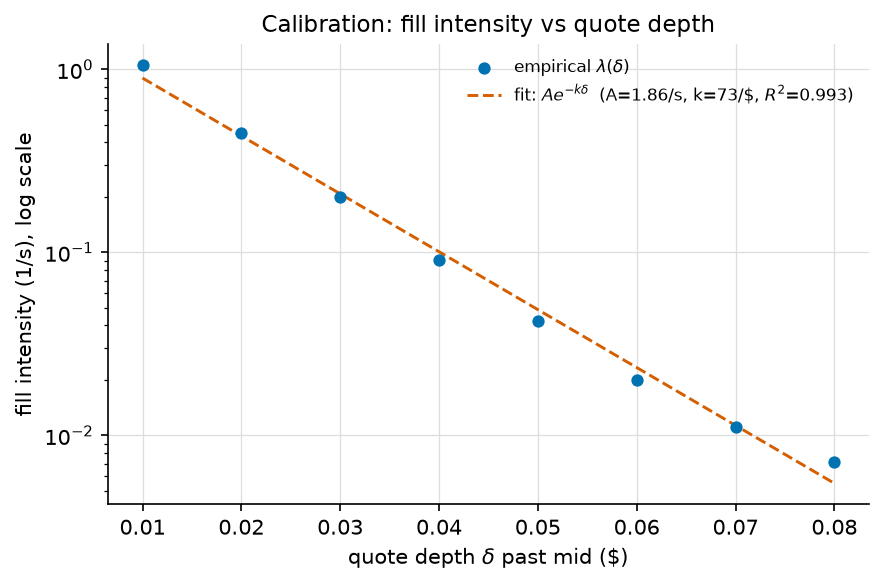
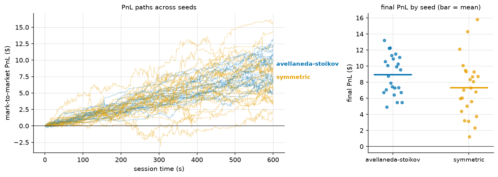
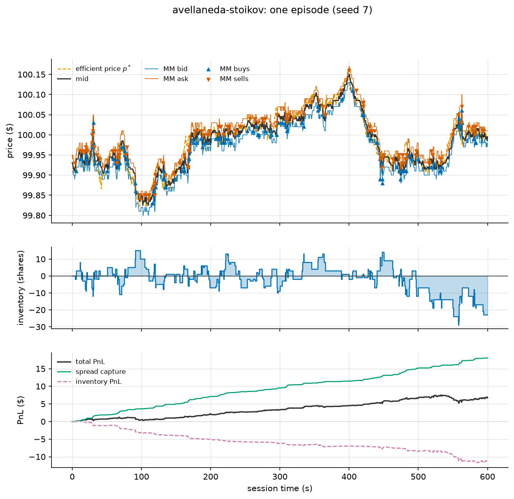
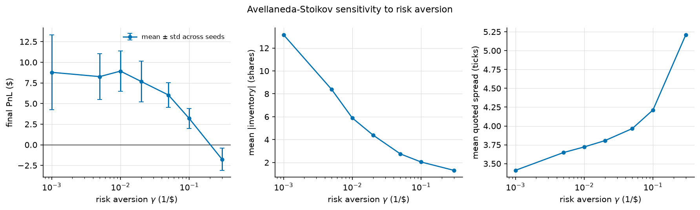
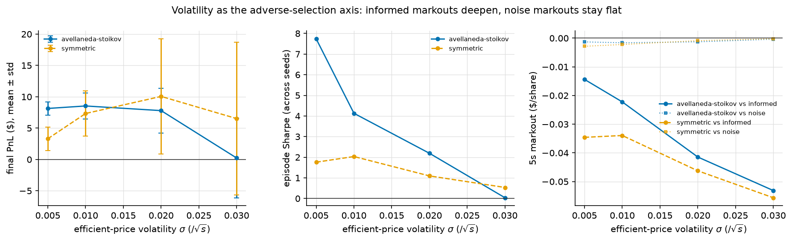

# Results

All numbers reproduce with `mm-sim all` (≈30s, single-threaded). Default
market: tick $0.01, initial price $100, efficient-price volatility σ = $0.01/√s,
600s sessions, 24 seeds per configuration, strategies compared on common random
numbers. The strategy never sees generator truth: it runs on σ̂ = 0.0113 $/√s
(estimated from 5s realized volatility; true value 0.01) and k̂ = 72.8/$
(fitted from flow-only fill intensities). Raw data: `results/summary.json`.

## 1. Calibration: the assumed fill-intensity law actually holds

The A-S model *assumes* quotes at depth δ fill at rate `λ(δ) = A e^{−kδ}`. In
this simulator that law is emergent, not imposed: measured from flow-only
runs, log fill intensity is linear in depth with **R² = 0.993** (A = 1.86/s,
k = 72.8/$). This closes the loop between the environment and the strategy's
model class — the strategy is optimal *for a market like this one*, with
parameters measured, not assumed.

## 2. Head-to-head: A-S vs. an unskewed symmetric quoter

| | Avellaneda-Stoikov (γ=0.01) | Symmetric (±3 ticks) |
|---|---|---|
| Mean final PnL | **$8.93** | $7.33 |
| Std of final PnL | **$2.43** | $3.60 |
| Episode Sharpe (across seeds) | **3.67** | 2.03 |
| Spread capture / inventory PnL | $19.34 / −$10.41 | $11.03 / −$3.69 |
| Mean \|inventory\| | **5.9 sh** | 12.5 sh |
| Mean max \|inventory\| (cap 30) | 25.6 sh | 27.5 sh |
| Mean quoted spread | 3.7 ticks | 6.6 ticks |
| Volume | 1154 sh | 360 sh |
| 5s markout, all / informed / noise ($/sh) | −0.010 / **−0.024** / −0.002 | −0.012 / −0.034 / −0.002 |

The economics, not just the numbers:

* **A-S earns more with 33% less PnL volatility — Sharpe 3.67 vs 2.03.** Both
  quoters are profitable (the noise flow subsidizes the market), but the
  baseline's PnL variance is dominated by the inventory it passively
  accumulates: with no skew, its position random-walks between the hard
  limits (mean |q| 12.5, regularly pinned at the cap).
* **The skew works exactly as the theory says.** A-S holds half the
  inventory while trading 3× the volume — the reservation-price shift tilts
  fill probabilities so the position mean-reverts, without ever crossing the
  spread to dump risk.
* **The decomposition shows where PnL comes from.** A-S: +$19.3 spread
  capture, −$10.4 inventory PnL. Inventory PnL is negative for both — that
  is adverse selection showing up in the carried position (fills correlate
  with subsequent drift). A-S pays a larger inventory-PnL toll per dollar of
  capture because it trades 3× more, but nets more, more stably.
* **Markouts identify who you lose to.** Fills against informed counterparties
  mark out at −2.4 ticks/share (A-S) and −3.4 (baseline); fills against noise
  are ≈ −0.2 ticks. Adverse selection is concentrated exactly where the model
  says it should be. A-S's shallower informed markout is a side-effect of
  quoting tighter: it gets picked off on smaller mispricings.

A single-episode view of the mechanism (quotes hugging the mid, inventory
mean-reverting around zero, spread capture climbing steadily while inventory
PnL bleeds):

## 3. Risk aversion sweep: γ prices the risk-return frontier

| γ (1/$) | mean PnL | std PnL | mean \|q\| | spread (ticks) |
|---|---|---|---|---|
| 0.001 | $8.78 | 4.55 | 13.2 | 3.4 |
| 0.01 | $8.93 | 2.43 | 5.9 | 3.7 |
| 0.05 | $6.03 | 1.51 | 2.8 | 4.0 |
| 0.3 | −$1.75 | 1.34 | 1.3 | 5.2 |

γ is not a nuisance parameter — it selects a point on a risk-return frontier:

* **γ → 0**: the skew vanishes, inventory balloons (|q| 13.2), mean PnL is
  the same as γ=0.01 but with nearly twice the variance — you are paid the
  same to carry much more risk.
* **Moderate γ (0.005–0.02)**: inventory is controlled at almost no cost in
  mean PnL. This is the regime the model is for.
* **Large γ**: the strategy pays for insurance it doesn't need — the skew
  term (γσ²τ per unit) grows past the half-spread, so after every fill the
  strategy immediately sheds inventory at sacrificed edge, and the widening
  spread loses the fill flow; by γ=0.3 it loses money outright.

The monotone middle and right panels (inventory ↓, spread ↑ in γ) match the
closed-form comparative statics exactly.

## 4. Volatility sweep: adverse selection scales with σ

Raising σ gives informed traders more edge per trade — the efficient price
gets further through stale quotes before the book reprices. Both A-S inputs
(σ̂, k̂) are re-estimated per regime.

* **The adverse-selection signature is clean**: 5s markouts against informed
  counterparties deepen monotonically from −1.4 to −5.3 ticks/share as σ
  rises, while markouts against noise stay pinned near zero at every σ. That
  contrast *is* adverse selection, isolated in one figure.
* **Risk-adjusted, A-S dominates in every regime where market making is
  viable**: Sharpe 7.7 vs 1.8 (σ=0.005), 4.1 vs 2.0 (σ=0.01), 2.2 vs 1.1
  (σ=0.02). The baseline's occasional higher *mean* (σ=0.02: $10.06 vs $7.79)
  comes with 2.6× the standard deviation — it is being paid for unpriced
  inventory risk.
* **σ=0.03 is an honest failure case**: A-S ≈ $0 ± 6.3, baseline $6.5 ± 12.2.
  With the tick, spread, and flow held fixed, volatility this high makes the
  mid itself unreliable (mid–p* gap p95 ≈ 11 ticks) and passive quoting at a
  fixed γ stops paying. A real desk would widen γ, quote wider, or pull
  quotes — the model tells you *that* through its inputs, but only if you let
  γ respond to the regime. We report the fixed-γ result rather than tuning it
  away.

## 5. What the simulator demonstrates

1. **Inventory skew is the cheap risk control.** Tilting quote *probabilities*
   (reservation price) removes half to two-thirds of inventory variance at
   nearly zero cost in mean PnL — confirmed against an identical-plumbing
   baseline on common random numbers.
2. **Adverse selection is measurable and attributable.** Markouts split by
   counterparty pin the systematic losses on informed flow, deepening with
   σ, while noise flow is confirmed as the (near-)free revenue source.
3. **Model inputs must be estimated with microstructure care.** The naive
   high-frequency σ̂ is inflated 1.5–2.5× by bid-ask bounce; feeding it to A-S
   makes the skew overshoot and destroys performance. Sampling realized vol at
   5s (volatility-signature reasoning) fixed this — the single most
   instructive bug of the project.
4. **Theory holds where its assumptions hold, and degrades where they don't.**
   The exponential fill law emerges from the flow (R²=0.99) and A-S wins
   risk-adjusted in every viable regime; at extreme σ with fixed γ, discrete
   ticks, passivity clipping, and mid-anchoring failure break the model's
   assumptions and it says so in the PnL.
